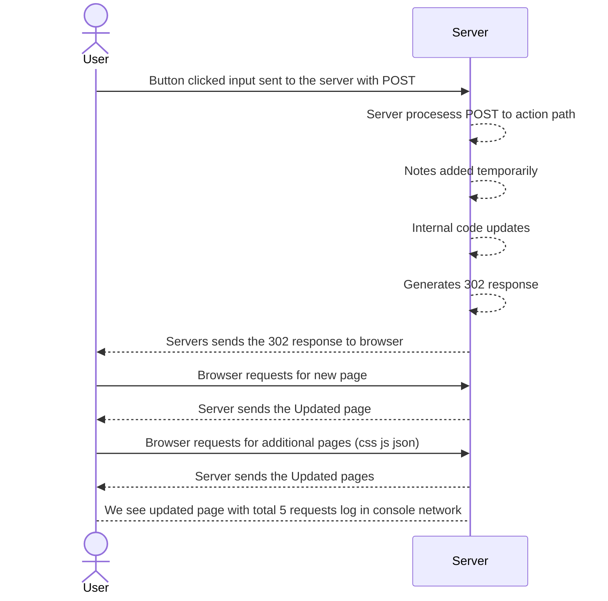

```mermaid
sequenceDiagram
actor User
participant Server
User->>Server:Button clicked input sent to the server with POST
Server-->>Server:Server procesess POST to action path
Server-->>Server:Notes added temporarily
Server-->>Server: Internal code updates
Server-->>Server: Generates 302 response
Server-->>User:Servers sends the 302 response to browser
User->>Server:Browser requests for new page
Server-->>User:Server sends the Updated page
User->>Server:Browser requests for additional pages (css js json)
Server-->>User:Server sends the Updated pages
User-->Server:We see updated page with total 5 requests log in console network
```
