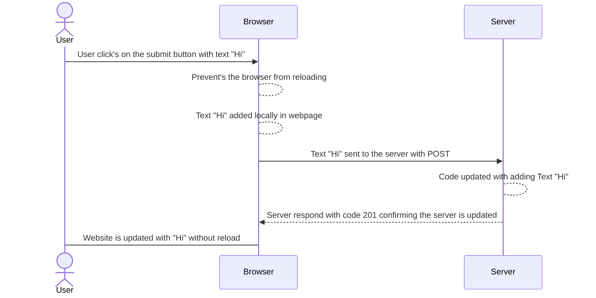

```mermaid
sequenceDiagram
actor User
participant Browser
participant Server
User->>Browser:User click's on the submit button with text "Hi"
Browser-->Browser: Prevent's the browser from reloading
Browser-->Browser: Text "Hi" added locally in webpage
Browser->>Server: Text "Hi" sent to the server with POST
Server-->Server: Code updated with adding Text "Hi"
Server-->>Browser: Server respond with code 201 confirming the server is updated
User->Browser: Website is updated with "Hi" without reload
```
